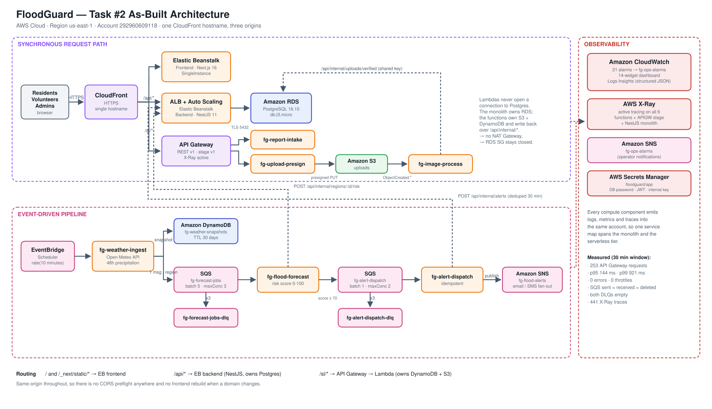

# Introduction

Flooding remains one of the most destructive recurring natural hazards, and the
gap between a rising river and a warned population is frequently measured in
minutes rather than hours. FloodGuard addresses Problem Background 4 by providing
a cloud-native early warning and emergency response platform for residents,
volunteers, and municipal authorities. Task 1 delivered a working server-based
implementation of that platform. Task 2, documented here, extends it with a
serverless, event-driven tier and integrates the monitoring instrumentation
required to evaluate the result.

The objective of this report is threefold. First, it summarises the system
inherited from Task 1 and states precisely how the architecture was expanded.
Second, it documents the implementation of the serverless components and the
microservices that consume Amazon Simple Storage Service (S3), Amazon Simple
Notification Service (SNS), and Amazon Simple Queue Service (SQS). Third, it
presents monitoring evidence gathered from Amazon CloudWatch and AWS X-Ray and
discusses what that evidence reveals about the performance of the expanded system.
All resources described were deployed to a single AWS account in the
us-east-1 region and were verified live before this report was written.

## Task 1 Existing System Summary

Task 1 produced a two-tier server-based deployment. A Next.js frontend and a
NestJS application server were each hosted on AWS Elastic Beanstalk, backed by a
single Amazon Relational Database Service (RDS) instance running PostgreSQL 16.
Three separate Amazon CloudFront distributions fronted the deployment, one for the
web tier and others for the application programming interface (API).

All background processing ran inside the application server. Weather polling, flood
risk scoring, and alert creation were executed by an in-process scheduled task
using the `@nestjs/schedule` package. This design was functional but structurally
constrained in three respects. The background work competed with user requests for
the same compute resources; the scheduled task could not scale independently of the
web workload; and, as Section *Changes in the Architecture* explains, the scheduler
would have produced duplicate alerts had the environment ever scaled beyond a
single instance. Table 1 summarises the inherited components.

::: {custom-style="FigNum"}
Table 1
:::

::: {custom-style="FigTitle"}
Components Inherited From the Task 1 Server-Based Deployment
:::

| Tier | Service | Configuration | Responsibility |
|---|---|---|---|
| Presentation | Elastic Beanstalk | Next.js 16, single instance | Server-rendered web interface |
| Application | Elastic Beanstalk | NestJS 11, load balanced | Business logic and REST API |
| Data | Amazon RDS | PostgreSQL 16.10, db.t3.micro | Relational persistence |
| Delivery | Amazon CloudFront | Three distributions | Transport security and caching |
| Scheduling | `@nestjs/schedule` | In-process cron, 10 min | Weather polling and alerting |

::: {custom-style="APANote"}
*Note.* The scheduling row represents the component wholly replaced in Task 2. All other rows were retained and extended.
:::

## Proposed Cloud Architecture

The proposed architecture for Task 2 introduced a serverless tier alongside the
retained server tier, on the principle that workloads with different scaling
characteristics should not share a compute boundary. Scheduled ingestion, risk
scoring, and notification fan-out are episodic and bursty, whereas the web and API
tiers serve steady interactive traffic. Separating them permits each to scale on
its own signal, a property Newman (2021) identifies as the primary operational
benefit of decomposition.

The proposed design consolidated the three CloudFront distributions into a single
distribution with path-based routing to three origins. It placed Amazon API Gateway
in front of a set of AWS Lambda functions rather than in front of the existing
application server, since only the former arrangement makes the functions
independently addressable services. It introduced Amazon DynamoDB for append-only
weather time-series data, SQS for decoupling the processing stages, and SNS for
alert fan-out. Figure 1 presents the resulting architecture as deployed.

::: {custom-style="FigNum"}
Figure @FIG
:::

::: {custom-style="FigTitle"}
FloodGuard Task 2 As-Built Cloud Architecture
:::

::: {custom-style="APANote"}
*Note.* The figure was generated from the deployed resource inventory rather than drawn from the design proposal, so every component shown corresponds to a provisioned resource. Solid arrows denote synchronous request flow; dashed arrows denote authenticated service-to-service calls.
:::

## Changes in the Architecture

Reviewing the proposed design against the Task 1 codebase before implementation
identified several elements that would not have worked as originally drawn. Each
was corrected, and the corrections constitute the substantive architectural change
between the two tasks. Table 2 records them.

::: {custom-style="FigNum"}
Table 2
:::

::: {custom-style="FigTitle"}
Architectural Changes Between Task 1 and Task 2
:::

| Element | Issue identified | Resolution |
|---|---|---|
| API Gateway placement | Positioned in front of Elastic Beanstalk, adding a network hop without adding capability. No request would reach a function, so no part of the system became serverless. | API Gateway placed in front of the Lambda functions. |
| API Gateway protocol | HTTP APIs do not emit AWS X-Ray trace segments, and X-Ray evidence is a requirement of this task. | REST API (v1) selected, which emits trace segments. |
| Trigger chain | EventBridge was drawn as publishing directly to SQS, but a scheduled tick carries no per-item work to distribute. | Chain reordered to EventBridge, then Lambda, then SQS, then Lambda. |
| Queue topology | Queue and dead-letter queue were drawn as one component, concealing the redrive mechanism. | Four queues provisioned: two work queues and two dead-letter queues. |
| S3 integration | S3 was drawn as a passive store with no event wiring. | Object-created notification invokes an image verification function. |
| DynamoDB purpose | Intended to hold live risk levels already authoritative in PostgreSQL, creating a dual write with no owner. | Repurposed for append-only weather time-series with a 30-day expiry. |
| Database exposure | Multi-availability-zone deployment in private subnets exceeded the available budget and required a network address translation gateway. | Single availability zone retained, with a two-zone subnet group so promotion remains a single API call. |

::: {custom-style="APANote"}
*Note.* Each resolution was implemented and verified rather than proposed. The protocol decision in row 2 is discussed further in Section *API Gateway REST API*.

:::

Two latent defects in the inherited system were also corrected. The first concerned
duplicate alerting. Because `@nestjs/schedule` executes its cron on every running
instance, and because the Task 1 configuration constrained only instance type and
not the minimum and maximum instance count, the first autoscaling event would have
caused every flood alert to be delivered twice to real subscribers. Relocating the
trigger to Amazon EventBridge Scheduler resolves this, since the scheduler fires
once irrespective of fleet size, and the in-process cron is now disabled by a
configuration flag. The second defect concerned credential handling: the Task 1
deployment configuration contained the live database password and token signing
secret, committing both permanently to version control history. Credentials are now
generated into AWS Secrets Manager and injected at deployment time.

## Microservices

Six Lambda functions were implemented. Each is deployed with its own least
privilege execution role, an arrangement that matters because the functions do not
carry equivalent trust. A single shared role would grant the unauthenticated public
intake endpoint permission to publish alerts to every subscriber, which is a
privilege escalation path rather than a convenience.

### Weather Ingestion Function

The `fg-weather-ingest` function is invoked on a ten-minute schedule by EventBridge.
It retrieves 48-hour hourly precipitation forecasts from the Open-Meteo API
(Open-Meteo, 2025) for each monitored region, writes a snapshot to DynamoDB, and
publishes one message per region to the forecast work queue. The function performs
input and output only. Risk scoring is deliberately excluded so that a slow change
to the scoring algorithm cannot stall ingestion.

### Flood Forecast Function

The `fg-flood-forecast` function consumes the forecast queue in batches of five and
computes a composite risk score from zero to one hundred, combining weather
contribution, sensor readings, and geographic exposure. Scores at or above the alert
threshold are published to the alert dispatch queue. The scoring logic was ported
from the Task 1 application server without modification, which keeps the two
implementations behaviourally identical.

### Report Intake Function

The `fg-report-intake` function serves unauthenticated public flood reports received
through API Gateway. It is the only write path in the system that requires no
credential, and its execution role is correspondingly narrow.

### Upload Presign Function

The `fg-upload-presign` function issues time-limited presigned upload URLs for S3,
permitting a browser to transmit a photograph directly to object storage without the
image bytes traversing the application server.

### Image Processing Function

The `fg-image-process` function is invoked by an S3 object-created notification. A
presigned URL constrains the declared content type but S3 does not verify that the
uploaded bytes match that declaration, so this function performs the server-side
check: it reads the file signature, tags the object as verified or rejected, and
reports the verdict to the application server.

### Alert Dispatch Function

The `fg-alert-dispatch` function consumes the alert queue one message at a time,
creates the alert record, and publishes to the SNS fan-out topic. Because SQS
provides at-least-once delivery, the function is idempotent: a matching active alert
within a thirty-minute window is suppressed rather than duplicated.

## Benefits of the Expansion

The expansion delivers four measurable benefits. Independent scalability is the
first: each processing stage now responds to its own signal, with ingestion scaling
on schedule, scoring on queue depth, and dispatch on triggered alert volume, rather
than by adding whole application instances. Second, the queue boundary confers
deployment flexibility, since the scoring function can be replaced while messages
accumulate and drain without request loss. Third, resilience improves through
explicit dead-letter queues and partial batch failure reporting, which prevent a
single malformed message from forcing redelivery of an entire batch. Fourth, cost
efficiency improves because the functions consume compute only while executing,
consistent with the economic model described by Adzic and Chatley (2017).

A further architectural benefit concerns data ownership. The Lambda functions never
open a connection to PostgreSQL. The application server owns the relational
database, the serverless tier owns DynamoDB and S3, and the two communicate over
SQS and an authenticated internal HTTP interface. This preserves a single writer per
data store, avoiding the dual-write consistency problem Richardson (2018) identifies
as a common decomposition failure. It also keeps the functions outside the virtual
private cloud, which avoids the recurring cost of a network address translation
gateway and allows the database security group to remain closed.
